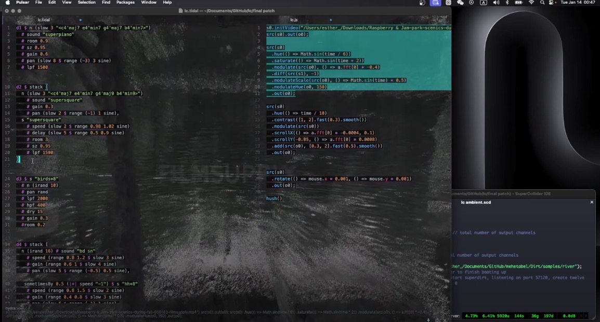

# TidalCycles and Hydra Live Coding Patch

This repository contains a live coding setup combining TidalCycles for sound generation and Hydra for visual interaction. It includes everything you need to explore audiovisual live coding performances, leveraging custom sound samples set up in SuperCollider.

## Repository Structure

1. **`sound patch.tidal`**  
   This file contains the TidalCycles sound code. Run this in [Pulsar](https://pulsar-edit.dev/) to generate the audio portion of the live performance.

2. **`visual patch.js`**  
   This file contains the Hydra code for generating dynamic, real-time visuals. Run this in Pulsar to interact with and visualize the sound dynamically.

3. **`sample.scd`**  
   This SuperCollider file is used to set up custom samples for use in TidalCycles. It configures SuperCollider to load your own sample files and ensures compatibility with your sound patch.

## Demo Video

Here’s a demonstration of the TidalCycles and Hydra integration in action:

[](https://youtu.be/8g4t1AS1lEQ)

> *Click the image to watch the video on YouTube.*

## Setting Up Your Environment

### Prerequisites
- [TidalCycles](https://tidalcycles.org/)
- [SuperCollider](https://supercollider.github.io/)
- [Hydra](https://hydra.ojack.xyz/)
- [Pulsar](https://pulsar-edit.dev/) (recommended for live coding)
  
### Configuration Steps
1. **Install and configure SuperCollider for custom samples:**
   - Open `sample.scd` in SuperCollider.
   - Update the sample path in `~dirt.loadSoundFiles("/path/to/your/samples/**");` to point to your custom sample directory.
   - Evaluate the code in SuperCollider to load your samples.

2. **Run the TidalCycles sound patch:**
   - Open `sound patch.tidal` in Pulsar.
   - Ensure that TidalCycles is properly set up and connected to SuperCollider.
   - Start live coding and enjoy creating audio patterns.

3. **Run the Hydra visual patch:**
   - Open `visual patch.js` in Pulsar.
   - Ensure Hydra is set up and running.
   - Start the visual patch to generate visuals synchronized with your sound.

## Example SuperCollider Configuration

Below is an example configuration snippet from `sample.scd` to use your own samples:
```supercollider
s.options.numBuffers = 1024 * 256;
s.options.memSize = 8192 * 32;
s.options.maxNodes = 1024 * 32;
s.options.numOutputBusChannels = 2;
s.options.numInputBusChannels = 2;

s.waitForBoot {
    ~dirt = SuperDirt(2, s);
    ~dirt.loadSoundFiles;
    ~dirt.loadSoundFiles("/path/to/your/samples/**");
    s.sync;
    ~dirt.start(57120, 0 ! 12);
};
